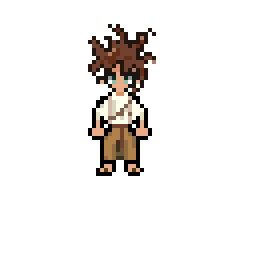
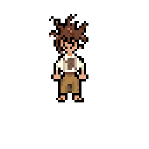
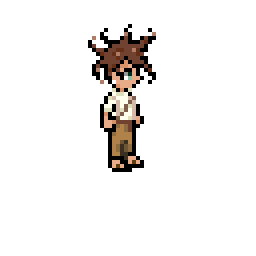
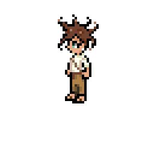

# Oathbound

**Oathbound** is an RPG game developed in **C++17** using **SFML 2.6.2**.
This project is designed to be cross-platform (Windows, Linux, macOS) and uses CMake for configuration and compilation.

---

## Synopsis

> *(Add here the synopsis or story of your RPG. Describe the world, main characters, player’s goal, etc.)*

---

## Preview









---

## Features

* 2D RPG with exploration and combat
* Inventory and item management
* Dialogues and interactions with NPCs
* Quest system and character progression
* Graphics and audio via SFML 2.6.2

---

## Prerequisites

Before building the project, make sure you have installed:

* **CMake** ≥ 3.16
* **C++17 compatible compiler**

  * Windows: Visual Studio or MinGW
  * Linux/macOS: GCC or Clang
* **SFML 2.6.2**

  * Windows: include headers and DLLs in `include` and `lib`
  * Linux/macOS: via `find_package(SFML 2.6.2 COMPONENTS graphics window system REQUIRED)`

---

## Project Structure

```
Oathbound/
├─ src/              # C++ source files
├─ include/          # Headers
├─ lib/              # SFML DLLs (Windows) or static libs
├─ bin/              # Contains the binary after compilation
├─ build/            # CMake build folder
└─ CMakeLists.txt
```

---

## Build Instructions

### 1. Create the build folder

**Windows (PowerShell):**

```powershell
cd "C:\path\to\Oathbound"
rmdir build -Recurse -Force
mkdir build
cd build
```

**Windows (cmd):**

```cmd
cd "C:\path\to\Oathbound"
rmdir /s /q build
mkdir build
cd build
```

**Linux/macOS:**

```bash
cd ~/path/to/Oathbound
rm -rf build
mkdir build
cd build
```

---

### 2. Configure the project with CMake

```powershell
cmake ..
```

* Configures the project for **Release** and prepares Makefiles / Visual Studio files.

---

### 3. Build the project

**Windows:**

```powershell
cmake --build . --config Release
```

**Linux/macOS:**

```bash
cmake --build .
```

* The binary will be generated directly in `bin/`.
* On Windows, make sure the SFML 2.6.2 DLLs are also in `bin/`.

---

### 4. Run the game

**Windows:**

```powershell
.\bin\main.exe
```

**Linux/macOS:**

```bash
./bin/main
```

---

## Notes

* The project is configured to build **Release only**, to ensure compatibility with the SFML DLLs.
* If you add assets (images, sounds, maps), place them in an appropriate folder and adjust the paths in the code.

---

## Contributions

There are four main contributors to this project right now :

- **Jeff Vieyra**

GitHub : [BJeff17](https://github.com/BJeff17)

- **Anis Morat**

GitHub : [Shiro-qb](https://github.com/Shiro-qb)

- **Gérald Guidi**

Github : [cedric20061](https://github.com/cedric20061)

- **Josué Mongan**

GitHub : [Josh012006](https://github.com/Josh012006)

Contributions are welcome!
If you want to contribute, please create a branch, make your changes, and submit a pull request.

---

## License

Oathbound is distributed under a **Custom License – Non-Commercial Use with Attribution Requirement**.

* **Non-commercial use only**: the software may not be used for commercial purposes without written permission from all original authors.
* **Attribution required**: any redistribution or modification must clearly credit the original authors (README, documentation, user interface, etc.).
* **No warranty**: the software is provided “as is” without any warranty.

See the [LICENSE](LICENSE) file for the full text.
